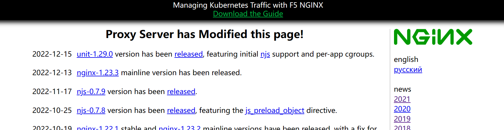

# UNIX大作业 -- 支持简单插件的反向代理服务器


## 项目介绍

   受Nginx启发，结合UNIX课程学习内容，完成了这样一款简单的反向代理服务器。项目使用 C++ 编写，结合前面课程作业编写的线程池作为代理服务器的连接池，拥有简单的配置文件，并支持编写自定义插件来扩展服务器功能。整个程序可以供日常正常使用，后续改进还可以增加HTTPS支持等。

   **反向代理的工作原理是，代理服务器来接受客户端的网络访问连接请求，然后服务器将请求有策略的转发给网络中实际工作的业务服务器，并将从业务服务器处理的结果，返回给网络上发起连接请求的客户端。   —— 百度百科**

 

## 主要功能

   **HTTP反向代理** - 将客户机请求转发至真实服务端地址，将服务端的返回响应转发至客户机。常用于内网隐藏真实主机、负载均衡等用途

   **线程池** - 使用前面课程作业编写的线程池，支持在配置文件中修改线程池的运行配置参数。

   **简单的插件系统** - 提供了一套简单的编写中间件的设施。可以使用C++编写插件，编译为动态链接库，由代理服务器启动时加载。在客户端请求和服务端响应到达时，插件将得到通知，可以对请求和响应内容按需要进行修改和记录等。插件系统极大地提高了代理服务器的可扩展性。

 

## 主要部分

   源码主要分为几个部分：

#### 核心代理程序

   Proxy.cpp，HttpRequestPacket.h，HttpReponsePacket.h

   包含核心逻辑代码，以及HTTP请求、响应拆解类，便于代码编写

#### 插件支持部分

   Plugins.cpp，Plugins.h

   包含插件加载、消息传递等插件支持功能

#### 其他辅助代码

   Utils.cpp，Utils.h，Logger.h，ThreadPool目录，SimpleIni目录

   包含一些实用工具函数、Logger类、线程池，以及使用的第三方库：SimpleIni（用于解析INI配置文件）

#### 插件Demo

   PluginDemo目录

   包含一个插件demo，可以照此demo编写新的插件，实现对代理服务器功能的拓展，乃至编写功能复杂的中间件（如负载均衡、请求过滤、响应缓存等）

 

## 编译运行

   进入目录，**运行./run.sh**，将使用gcc编译插件Demo以及代理服务器本体，随后启动服务器。按Ctrl+C停止服务器。

   启动服务器后，使用浏览器打开[http://localhost:8888/](http://localhost:8888/)（配置文件中默认端口8888），可以看到正常代理了测试网站nginx.org，且插件正常工作，修改了页面中的一些内容。


   点击页面右侧的链接，可以看到跳转到了子页面，并且仍然是正常地进行代理工作

   

   另外，如果加载了PluginDemo中的插件，会注意到nginx.org页面的上方原有的“nginx news”字样被替换为“Proxy Server has Modified this page!“，这是插件demo工作的结果。插件位于plugins目录中，每个插件为一个动态链接库，按规范导出若干函数给代理服务器调用。服务器启动时，会加载所有插件，并在请求/响应到达时呼叫插件进行处理。

   默认情况下，使用测试网站nginx.com。可以将配置文件中的地址修改为其他HTTP地址，然后重新启动服务器，浏览器重新进入[http://localhost:8888/](http://localhost:8888/)，观察效果。


   后台输出如下：


   可以在配置文件中将日志等级修改为DEBUG来查看更详细的日志输出。

 

## 配置文件

配置文件config.ini：

```ini
[Main]
; 监听地址，默认表示接收所有连接
ListenHost=0.0.0.0      
; 代理服务器工作端口
ListenPort=8888        
; listen队列最大长度
MaxListen=5         
; 服务器使用的缓冲区大小
BufferSize=2048        
; 日志等级（可选DEBUG/INFO/WARN/ERROR/FATAL/NONE）
LogLevel=DEBUG        

[Proxy]
; 反向代理的目标服务器地址
TargetHost=nginx.org     
; 反向代理的目标服务器端口
TargetPort=80        

[ThreadPool]
; 线程池最小线程数
minThread=3         
; 线程池最大线程数
maxThread=20         
; 线程池收缩之前等待的时间（秒）
waitBeforeShrink=3      
```


## 逻辑简析

   反向代理服务器要实现代理功能，原理其实并不复杂。基本的逻辑是：创建线程池，创建socket监听客户端连接。针对每个客户端开启新的任务进行处理。

   对于每个客户端，根据其要求连接到指定的服务器，然后使用select同时监听C/S两者发来的消息。收到请求/响应后，进行处理，然后转发给另一方。代码中较为复杂的是HTTP协议的解析和请求/响应头内容的修改。

 

#### 请求处理

   一个HTTP请求的标准格式如下：

```
GET http://comp3310.ddns.net/index.html HTTP/1.1\r\n
Host: comp3310.ddns.net\r\n
Proxy-Connection: keep-alive\r\n
...\r\n
Cache-Control: max-age=0\r\n
\r\n
(body)
```

   客户端->服务端的内容被称为请求。第一行为请求行，为 <类型> <URI> <版本号> 格式，跟在请求行后面的是若干请求头，其中声明了访问的Host、一些请求参数等等。每一行都以\r\n结尾。请求头和请求体之间用\r\n\r\n隔开，请求体一般为空，或者包含POST发送的请求数据。

   针对客户端的请求，代理服务器需要对请求头中的Host进行修改，将Host修改为反向代理目标服务器的Host，然后将修改后的整个请求完整发送给目标服务器。服务器将响应结果返回给反代服务器，再由反代服务器转发给客户端。

 

#### 响应处理

   一个HTTP响应的标准格式如下：

```
HTTP/1.1 200 OK\r\n
Server: Apache Tomcat/5.0.12\r\n
Date: Mon,6Oct2003 13:23:42 GMT\r\n
...\r\n
Content-Length: 112\r\n
\r\n
(data)
```

   服务端->客户端的内容被称为响应。第一行为响应行，为 <版本号> <响应码> <响应信息> 格式，跟在请求行后面的是若干响应头，其中声明了响应的一些参数等等。每一行都以\r\n结尾。响应头和响应体之间用\r\n\r\n隔开，响应体就为服务器实际返回的数据（如HTML、图像数据等）

   针对服务端的响应，代理服务器基本不需要做修改，直接将完整的响应内容转发给客户端即可。

   有一种特殊情况：当服务器返回301/302重定向响应时，为了避免泄露服务器的实际地址，需要将响应头中的Location项修改为反代服务器的工作地址，由此保证客户端浏览器会跳转到正确的地址，可以继续进行反向代理。

 

   代码中篇幅较大的是涉及到请求完整接受的部分：处理Content-Length以及chunked模式。由于请求/响应可能较长，因此服务器会采用两种方法来返回较长请求：第一种是在HTTP请求/响应头中标识Content-Length，直接给出body中数据的长度，这种情况处理比较简单，直接读取到指定的字节数长度即可。

   第二种较为复杂的情况，服务器会使用chunked模式，返回长度不定的响应。这种情况需要循环读取，每次获取下一个chunk的大小，然后读取指定大小的数据块记录到body中，循环往复，直到给出的chunk大小为0，即表示请求完整接受完毕。

 

#### 多线程服务

   项目中，使用之前作业开发的可伸缩线程池作为连接池。每当有客户端连接时，向线程池中添加新任务，负责新客户端的请求和响应处理。当短时间内大量请求到来时，线程池将自动扩展，当线程池空置一段时间后，将自动收缩，减小资源消耗。线程池的具体功能详见上一次作业的说明文件，此处不再赘述。

 

#### 插件系统

   前面提到了为了完整获取响应内容进行了不少的努力，其目的之一即是为了支持功能完整的插件系统的运作，简化插件的编写。每个插件均为一个动态链接库，导出如下几个函数：

```c++
// 插件加载时调用
extern "C" bool Init(const char* configFile);
// 插件卸载时调用
extern "C" void Shutdown();
// 有客户端请求到达时调用
extern "C" bool ClientRequest(HttpRequestPacket *packet);
// 有服务端响应到达时调用
extern "C" bool ServerResponse(HttpResponsePacket *packet);
```

   此处的extern "C" 是为了禁用编译器的命名改编。编译时，使用-shared -fPIC编译开关（类似demo的Makefile操作），然后将生成的 .so文件复制到服务器的plugins目录中。

   反代服务器启动时，会遍历plugins目录，对其中的每一个so尝试加载并调用Init函数。初始化完毕所有库后，反代服务器开始工作。对于每一个到达的请求/响应，服务器会遍历插件列表，调用其中的每一个插件的ClientRequest/ServerResponse函数，传入已经解析好的请求/响应类结构。在插件代码中可以直接对解析好的数据进行读取、修改。

 

   演示使用的插件Demo进行了如下操作：首先关闭gzip压缩，使http传输明文数据。随后当检测到响应码为200，响应Content-Type为text/html时，将响应体（html源码）中的所有“nginx news”替换为“Proxy Server has Modified this page!”，于是就达到了之前图片中演示的效果。

   实际还可以编写更多有趣的功能，比如针对同一个Host进行负载均衡、针对请求内容进行敏感词检查和过滤等等。

####  

#### 其他实用函数

   包括一些辅助功能的代码，包括string类辅助，以及当时为了调试方便而写了一个简单的Logger类用于输出日志。


## 总结和改进

   目前，这个反代服务器拥有了基本的代理功能、插件自定义功能。除此之外，还可以往很多其他的方向进行功能拓展，如支持HTTPS（使用OpenSSL）, 支持响应缓存提高响应速度、支持动态语言CGI（如JS脚本编写插件）、支持将日志记录到文件等等。

   项目中使用到的第三方库：SimpleIni（用于解析INI配置文件）

   https://github.com/brofield/simpleini
